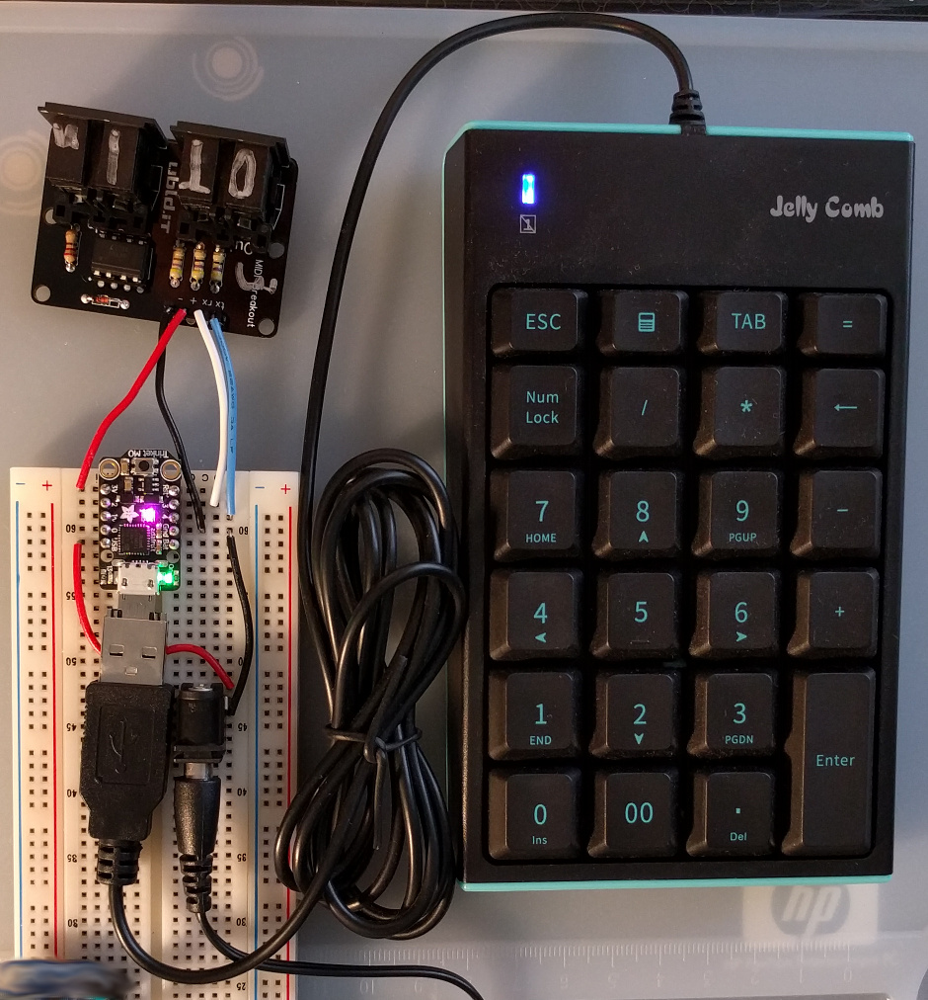

# Convert QWERTY USB keyboard to MIDI button controller

The photo shows a numeric keypad but a 101 key keyboard can be used.

The USB keyboard is plugged into the Adafruit Trinket M0 (SAMD21) using a USB
OTG to USB host adapter. The Trinket M0 sketch translates USB key codes to MIDI
messages using the Arduino MIDI library. The MIDI messages are sent out the
Serial1 hardware UART to a MIDI breakout board with MIDI DIN connectors.
 
The sketch demonstrates how to send MIDI messages such as Note On/Off,
Program Change, and System Exclusive.

Since this project uses MIDI DIN connectors, it can be connected directly to a
MIDI synth with DIN connectors. No computer required.

If you want to connect this project to a computer via USB, see the related
project https://github.com/gdsports/MIDIUARTUSB. Remove the MIDI breadout board
then connect the Trinket M0 Tx/Rx to the Pro Micro Rx/Tx. More on this later.

## Hardware

* Adafruit Trinket M0

NOTE: The Trinket M0 is very different from the original Trinket. This project
does not work on the original Trinket.

Be sure to work through the Adafruit tutorial to install the board package and
run at least one example program. This ensures the board is working before
connecting the other parts.

https://www.adafruit.com/product/3500

* USB OTG to USB host cable or adapter

The photo shows the tiny adapter instead of the cable. One problem with the
adapter is it is so small so it is easy to lose. And it looks like it broke off
from another piece of gear!

These are generic parts so they can be purchased from many other stores.

https://www.adafruit.com/product/1099

https://www.adafruit.com/product/2910

* 5 V, 500 mA DC power supply and connector

The photo shows a barrel jack since it can be used on a bread board but any
connector that matches the power supply can be used.

NOTE: Connect 5V to the Trinket M0 only when it is not connected to a
computer. When connected to a computer the Trinket M0 receives power via its
USB connector. The power supply must be connected when the Trinket M0 is
connected to a USB keyboard since the Trinket M0 must supply power to the
keyboard.

* MIDI breakout board

The MIDI board in the photo came as a kit for 5V logic levels so it has
substituted resistors for 3.3V operation. The following PJRC guide for Teensy
3.x is useful because Teensy 3.x uses the same 3.3V logic levels as the Trinket
M0.

https://www.pjrc.com/teensy/td_libs_MIDI.html

## Arduino Libraries

The USB host library is included with the Trinket M0 board package so it does
not need to be installed.

Install the MIDI Library by Forty Seven Effects using the IDE library manager.

## Connections

|5V DC   |Trinket M0  |MIDI breakout|
|--------|------------|-------------|
|        |3V          |+            |
|        |2           |             |
|        |1~          |             |
|        |0           |             |
|5V      |USB         |             |
|        |RST         |             |
|        |3 UART Rx   |Rx           |
|        |4 UART Tx   |Tx           |
|GND     |GND         |-            |
|        |BAT         |             |
